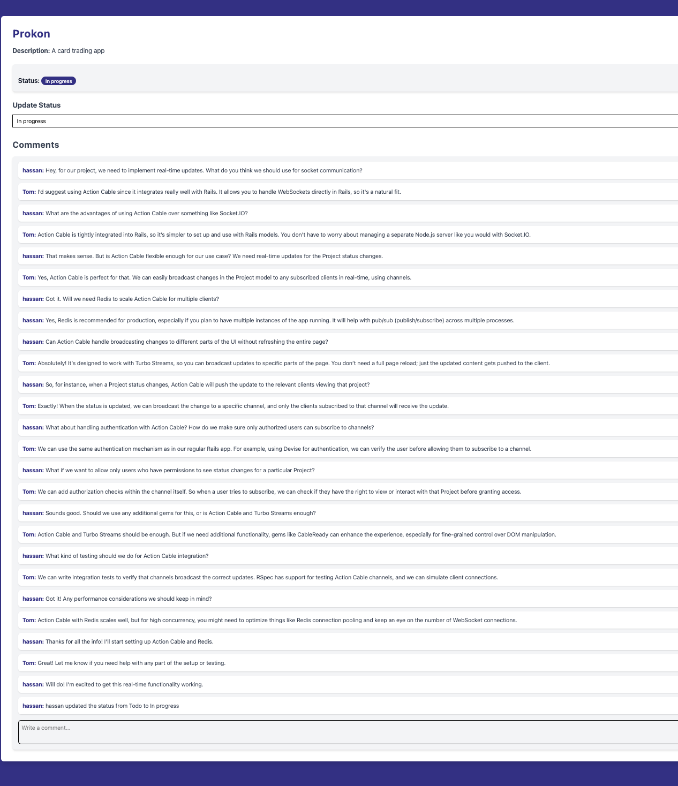

# Project Conversation History

## 1. Ensure to have necessary dependencies

You must have docker and docker compose installed on your machine

Then you can execute the following commands

```
docker compose up --build
```

## 2. Execute the Application

Go to localhost:3000

Press Login and then enter the credentials

```
email: test@gmail.com
password: password
```

## 3. Execute the Specs

In order to run tests execute the following commands
```
rspec ./spec
```

## 4, Project Conversation of Hassan



